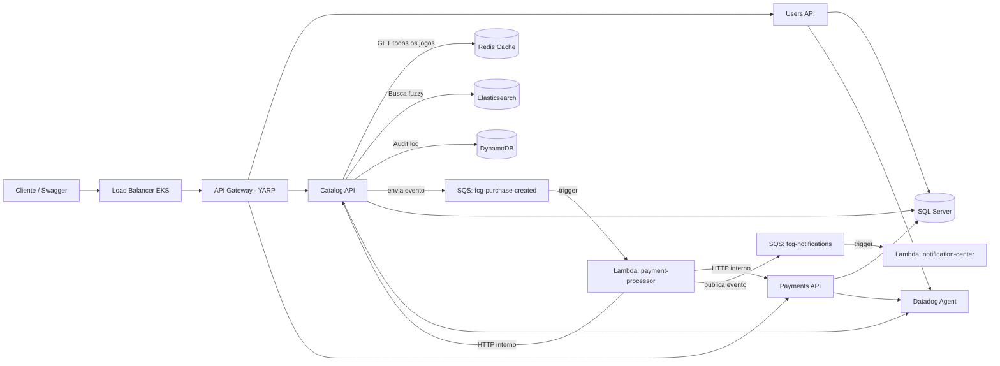
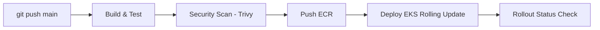

# FCG Fase 4

Projeto da **FIAP Cloud Games (FCG)** para a Fase 4, com foco em **automação de entrega (CI/CD)**, **persistência poliglota (NoSQL + Cache + Busca)**, **Kubernetes gerenciado na cloud** e **performance**.

## Objetivo do projeto

Esta solução evolui o sistema da Fase 4 para uma arquitetura Cloud-Native com:

- **3 microsserviços principais** em .NET 8:
  - `users-api_fase4`
  - `catalog-api_fase4`
  - `payments-api_fase4`
- **API Gateway** implementado com **YARP em ASP.NET Core**
- **2 Lambdas AWS** para processamento assíncrono:
  - `notification-center`
  - `payment-processor`
- **Persistência Poliglota**:
  - **SQL Server** — dados relacionais (usuários, jogos, compras, pagamentos)
  - **DynamoDB** — audit logs de eventos (NoSQL, alta volumetria)
  - **Redis** — cache distribuído de consultas (TTL 5 minutos)
  - **Elasticsearch / Amazon OpenSearch** — busca avançada com fuzzy search
- **Kubernetes gerenciado** (AWS EKS) com rolling update sem downtime
- **CI/CD** com **GitHub Actions** (build → test → push ECR → deploy EKS)
- **Security Scan** de imagens Docker com **Trivy**
- **Observabilidade** com **Datadog**, logs estruturados e traces distribuídos

---

## Estrutura do repositório

```text
fiap-fase4/
├── .github/
│   └── workflows/
│       └── cicd-aws.yml          # Pipeline CI/CD completo
├── GatewayAPI/
│   ├── GatewayAPI.sln
│   ├── README.md
│   └── GatewayAPI/
├── users-api_fase4/
│   ├── FCGUsersAPI.sln
│   ├── README.md
│   ├── UsersAPI/
│   ├── Core/
│   ├── Infrastructure/
│   └── Tests/
├── catalog-api_fase4/
│   ├── FCGCatalogAPI.sln
│   ├── README.md
│   ├── CatalogAPI/
│   ├── Core/
│   ├── Infrastructure/
│   └── Tests/
├── payments-api_fase4/
│   ├── FCGPaymentsAPI.sln
│   ├── README.md
│   ├── PaymentsAPI/
│   ├── Core/
│   ├── Infrastructure/
│   └── Tests/
├── lambdas/
│   ├── notification-center/
│   └── payment-processor/
├── k8s/                          # Manifestos Kubernetes
│   ├── namespace.yaml
│   ├── secrets.yaml
│   ├── configmaps/
│   │   ├── fcg-config.yaml
│   │   └── gateway-yarp-config.yaml
│   ├── users-api/
│   ├── catalog-api/
│   ├── payments-api/
│   ├── gateway-api/
│   ├── sqlserver/
│   ├── redis/
│   └── datadog/
└── observability/
    ├── docker-compose.yml        # Dev local (com Redis e Elasticsearch)
    └── docker-compose.aws.yml   # Imagens ECR
```

---

## Componentes da arquitetura

### 1. Users API

Responsável por:
- cadastro e autenticação de usuários via JWT
- autorização baseada em roles (User / Admin)
- publicação de eventos de registro no SQS (`fcg-notifications`)
- audit log de ações

Pasta: `users-api_fase4`

### 2. Catalog API

Responsável por:
- catálogo de jogos (CRUD)
- compras e biblioteca do usuário
- promoções
- **cache distribuído com Redis** (TTL 5 min, invalidado em escrita)
- **busca avançada com Elasticsearch** (fuzzy search, ordenação por relevância)
- **audit log no DynamoDB** (criação, alteração e remoção de jogos)
- indexação automática no Elasticsearch a cada inserção/edição

Pasta: `catalog-api_fase4`

### 3. Payments API

Responsável por:
- processamento de pagamentos (simulado: 80% aprovação, 20% rejeição)
- registro de transações
- integração com fluxo distribuído via Lambda

Pasta: `payments-api_fase4`

### 4. API Gateway com YARP

Responsável por:
- centralizar entrada das requisições
- rotear chamadas para os microsserviços
- expor a aplicação via Load Balancer no Kubernetes

Pasta: `GatewayAPI`

Rotas configuradas:
- `/users/*` → `users-api`
- `/games/*` → `catalog-api`
- `/payments/*` → `payments-api`

### 5. Lambda `notification-center`

- fila de entrada: `fcg-notifications`
- trigger automático SQS → Lambda
- saída: logs no CloudWatch

Pasta: `lambdas/notification-center`

### 6. Lambda `payment-processor`

- fila de entrada: `fcg-purchase-created`
- trigger automático SQS → Lambda
- chama `PaymentsAPI` e `CatalogAPI` internamente
- publica resultado em `fcg-notifications`

Pasta: `lambdas/payment-processor`

### 7. Kubernetes (EKS)

Manifestos em `k8s/`:
- Deployments com rolling update (`maxUnavailable=0`, `maxSurge=1`)
- Secrets gerenciados via CI/CD (sem hardcode em YAML)
- ConfigMaps para variáveis de ambiente não sensíveis
- Redis e SQL Server provisionados no cluster
- Datadog DaemonSet para observabilidade

---

## Fluxo de comunicação dos microsserviços

### Fluxo principal de compra

1. O cliente chama o **API Gateway** (Load Balancer EKS).
2. O Gateway (YARP) encaminha para o microsserviço correto.
3. No fluxo de compra, o **Catalog API** registra a intenção de compra no SQL Server.
4. O **Catalog API** publica um evento na fila **`fcg-purchase-created`**.
5. A Lambda **`payment-processor`** é acionada automaticamente.
6. A Lambda chama o **Payments API** internamente.
7. A Lambda chama o **Catalog API** para atualizar o status.
8. A Lambda publica resultado em **`fcg-notifications`**.
9. A Lambda **`notification-center`** processa e registra no CloudWatch.

### Fluxo resumido em diagrama



### Pipeline CI/CD



---

## Persistência Poliglota

| Tecnologia | Uso | Serviço |
|---|---|---|
| SQL Server | Dados relacionais (usuários, jogos, compras, pagamentos) | Todos |
| Redis | Cache de listagem de jogos (TTL 5 min) | Catalog API |
| DynamoDB | Audit logs de criação/alteração/remoção de jogos | Catalog API |
| Elasticsearch | Índice de busca com fuzzy search e relevância | Catalog API |

---

## Como rodar localmente

### Pré-requisitos

- .NET SDK 8
- Docker e Docker Compose

### Subir todos os serviços

Na pasta `observability`:

```bash
cp .env.example .env   # preencha as variáveis
docker compose up --build
```

O `docker-compose.yml` local sobe:
- SQL Server 2022
- Redis 7
- Elasticsearch 8.13.4
- Datadog Agent
- Users API (porta 5001)
- Catalog API (porta 5002)
- Payments API (porta 5003)

### Testar a busca Elasticsearch

```bash
GET http://localhost:5002/api/games/search?q=zelda
```

Suporta fuzzy search — `"zeld"`, `"Zeldaa"` e `"zelda"` retornam resultados.

### Testar o cache Redis

```bash
# Primeira chamada — Cache MISS (vai ao banco)
GET http://localhost:5002/api/games

# Segunda chamada — Cache HIT (retorna do Redis)
GET http://localhost:5002/api/games
```

Observe nos logs: `[Cache HIT]` / `[Cache MISS]` / `[Cache SET]` / `[Cache INVALIDADO]`.

### Testar audit log DynamoDB

```bash
# Após criar/editar um jogo:
GET http://localhost:5002/api/audit-logs?entityType=Game
```

---

## Deploy na AWS (EKS)

### Pré-requisitos AWS

- AWS CLI configurado
- Cluster EKS provisionado
- Amazon OpenSearch domain criado
- DynamoDB table `fcg-audit-logs` criada (hash key: `Id` / GSI: `EntityName-index`)
- Repositórios ECR criados (ou deixe o CI/CD criá-los)

### GitHub Secrets necessários

Configure em **Settings → Secrets and variables → Actions**:

| Secret | Descrição |
|---|---|
| `AWS_ACCESS_KEY_ID` | Credencial AWS |
| `AWS_SECRET_ACCESS_KEY` | Credencial AWS |
| `AWS_REGION` | Região (ex: `us-east-1`) |
| `AWS_ACCOUNT_ID` | ID da conta AWS |
| `EKS_CLUSTER_NAME` | Nome do cluster EKS |
| `SQL_SA_PASSWORD` | Senha do SQL Server |
| `JWT_KEY` | Chave JWT compartilhada |
| `ADMIN_PASSWORD` | Senha do usuário admin inicial |
| `INTERNAL_API_KEY` | Chave interna entre serviços |
| `DD_API_KEY` | Chave do Datadog |

### Atualizar ConfigMap antes do deploy

Em `k8s/configmaps/fcg-config.yaml`, substitua:
- `OPENSEARCH_ENDPOINT` → URL real do Amazon OpenSearch
- `ACCOUNT_ID` nas URLs SQS → ID real da conta AWS

### O que o pipeline faz automaticamente

Push para `main` dispara o workflow `.github/workflows/cicd-aws.yml`:

1. Build e testes (`dotnet test`) — inclui unit tests do `GameService`, `UserService` e `PaymentService`
2. Security scan com **Trivy** (HIGH/CRITICAL, non-blocking)
3. Push das imagens para **ECR** com tag `SHA` + `latest`
4. Apply dos manifestos K8s
5. `kubectl set image` → rolling update sem downtime
6. `kubectl rollout status` → aguarda confirmação

---

## Segurança

- **Zero hardcoded credentials**: `appsettings.json` tem valores vazios; secrets chegam via K8s Secrets injetados pelo CI/CD
- **Acesso externo**: via JWT Bearer + API Gateway
- **Acesso interno** entre serviços: header `x-internal-api-key`
- **Security Scan**: Trivy verifica imagens em cada pipeline

---

## Observabilidade

- **Serilog** — logs estruturados JSON
- **Datadog Agent** — DaemonSet no cluster, coleta APM, logs e métricas
- **Correlation ID** — rastreabilidade ponta a ponta entre serviços
- **Logs de cache** — `[Cache HIT]`, `[Cache MISS]`, `[Cache SET]`, `[Cache INVALIDADO]`

---

## Testes

```bash
# CatalogAPI (7 testes: 5 unit + 2 integração)
dotnet test catalog-api_fase4/FCGCatalogAPI.sln

# UsersAPI (6 testes: 4 unit + 2 integração)
dotnet test users-api_fase4/FCGUsersAPI.sln

# PaymentsAPI (7 testes: 5 unit + 2 integração)
dotnet test payments-api_fase4/FCGPaymentsAPI.sln
```

---

## Checklist de entrega

### Infraestrutura
- [ ] Cluster EKS ativo com pods rodando
- [ ] ECR com imagens publicadas
- [ ] Amazon OpenSearch domain ativo
- [ ] DynamoDB table `fcg-audit-logs` criada com GSI
- [ ] Redis rodando no cluster
- [ ] Load Balancer / Gateway acessível externamente

### Pipeline
- [ ] Push para `main` dispara o pipeline automaticamente
- [ ] Testes unitários passando no CI
- [ ] Trivy scan executando
- [ ] Rolling update concluindo sem downtime

### Funcionalidades
- [ ] `GET /api/games` retorna do cache (log `[Cache HIT]` na 2ª chamada)
- [ ] `GET /api/games/search?q=` retorna com fuzzy search
- [ ] `GET /api/audit-logs?entityType=Game` retorna logs do DynamoDB
- [ ] Fluxo de compra assíncrono validado ponta a ponta

### Vídeo (até 25 min)
- [ ] Mostrar pods no EKS
- [ ] Live deploy (push → pipeline → rollout)
- [ ] Demo da busca avançada (fuzzy)
- [ ] Demo do cache (cache hit vs miss nos logs)
- [ ] Demo do DynamoDB (audit logs)
